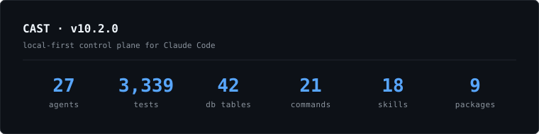
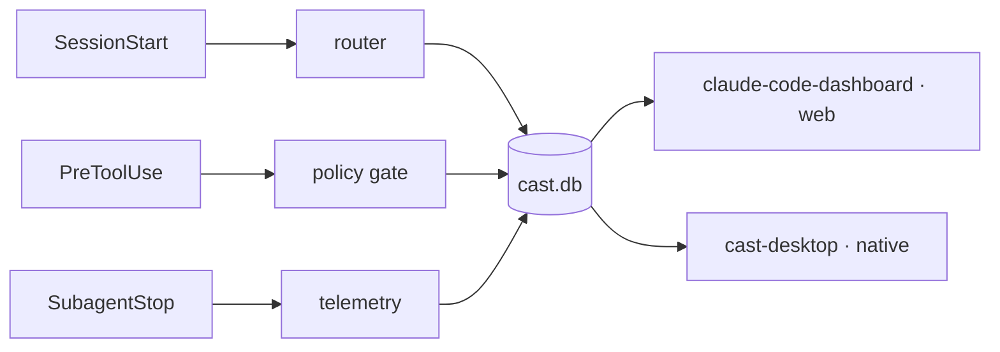

# Edward Kubiak

> **Agent infrastructure engineer** — I build the layer between you and the agent loop.

<!--[](https://linkedin.com/in/edward-kubiak/)-->
[](https://github.com/ek33450505/claude-agent-team)
[](LICENSE)
[](https://github.com/ek33450505/claude-agent-team/tree/main/tests)

**Columbus, Ohio** · [edwardkubiak.com](https://edwardkubiak.com) · [LinkedIn](https://linkedin.com/in/edward-kubiak/) · [edward.kubiak.dev@gmail.com](mailto:edward.kubiak.dev@gmail.com)

By day I architect and maintain production EdTech at META Solutions — 5 apps serving 4,200+ users across 900+ Ohio school districts. Nights and weekends I build agent infrastructure for Claude Code.

**Open to roles on agent infrastructure, developer tools, and Claude Code platform teams.**

---

## What I work on

Multi-agent systems fail in predictable ways: routing is opaque, memory bleeds across agents, policy is aspirational, and observability stops at the tool call. I build **[CAST](https://github.com/ek33450505/claude-agent-team)** to close those gaps — and a set of standalone, zero-LLM guardrails that fell out of building it. More info @ [castframework.dev](https://castframework.dev).

<p align="center">
  
</p>

## Projects at a glance

| Project | What it does | Stack | Status |
|---|---|---|---|
| **[CAST](https://github.com/ek33450505/claude-agent-team)** ⭐ | Local-first multi-agent control plane for Claude Code | Bash · SQLite | v<!-- CAST_VERSION -->8.0.0<!-- /CAST_VERSION --> |
| **[claude-code-dashboard](https://github.com/ek33450505/claude-code-dashboard)** ✨ | Web observability UI — 21+ views, live SSE streaming | React · Express | v<!-- VERSION:claude-code-dashboard -->2.5.0<!-- /VERSION:claude-code-dashboard --> |
| **[cast-desktop](https://github.com/ek33450505/cast-desktop)** | Native macOS observability app + embedded terminal | Tauri 2 · Rust | v<!-- VERSION:cast-desktop -->1.2.12<!-- /VERSION:cast-desktop --> |
| **[attest](https://github.com/ek33450505/attest)** | Zero-LLM gate: verifies a subagent's `DONE` vs the git delta | Python | v<!-- VERSION:attest -->0.1.1<!-- /VERSION:attest --> |
| **[looptrip](https://github.com/ek33450505/looptrip)** | Zero-LLM detector for multi-agent loop pathologies | Python · PyPI | v<!-- VERSION:looptrip -->0.1.1<!-- /VERSION:looptrip --> |
| **[misfire](https://github.com/ek33450505/misfire)** | Turns the rules your agents ignore into enforcement hooks | Python | v<!-- VERSION:misfire -->0.1.0<!-- /VERSION:misfire --> |

<sub>Deep-dives below — click any project to expand.</sub>

---

## CAST
<!--
```text
  ____    _    ____ _____
 / ___|  / \  / ___|_   _|
| |     / _ \ \___ \ | |
| |___ / ___ \ ___) || |
 \____/_/   \_\____/ |_|
```-->

[`claude-agent-team`](https://github.com/ek33450505/claude-agent-team) · Bash · MIT · **v<!-- CAST_VERSION -->8.0.0<!-- /CAST_VERSION -->** · <!-- CAST_AGENT_COUNT -->23<!-- /CAST_AGENT_COUNT --> agents · <!-- CAST_TEST_COUNT -->1797<!-- /CAST_TEST_COUNT --> tests · <!-- CAST_DB_TABLE_COUNT -->36<!-- /CAST_DB_TABLE_COUNT --> tables · <!-- CAST_COMMAND_COUNT -->20<!-- /CAST_COMMAND_COUNT --> commands · <!-- CAST_SKILL_COUNT -->18<!-- /CAST_SKILL_COUNT --> skills · <!-- CAST_PACKAGE_COUNT -->13<!-- /CAST_PACKAGE_COUNT --> packages

A local-first control plane for Claude Code. Multi-agent systems need observability, persistence, and unforgeable policy — CAST ships all three by construction, hung off Claude Code's own lifecycle hooks and recorded in a SQLite database that two surfaces read from.



- **Hook-driven dispatch over polling.** Routing, telemetry, and policy hang off lifecycle events (`SessionStart`, `PreToolUse`, `SubagentStop`, `Stop`) — no daemon, no background loop, no missed events.
- **Local-first SQLite everywhere.** Agent runs, routing decisions, memory, and quality gates all live in `~/.claude/cast.db`, replicated off the blast radius via Litestream — the database survives a full `~/.claude` wipe.
- **Per-agent memory, not shared context.** Each agent keeps scoped memory; isolation by default, coordination only when asked for.
- **Hard-blocking policy gates.** Force-pushes, raw `git commit`, destructive shell ops — refused at the hook seam, not left to agent discipline.

```bash
# Claude Code plugin (recommended)
/plugin marketplace add ek33450505/claude-agent-team
/plugin install cast && /plugin enable cast@cast
# or: brew tap ek33450505/cast && brew install cast
```

---

## Observability — two surfaces, one data layer

Everything CAST records lands in `cast.db`. Read it on the web, or natively — same data, two delivery models.

<details>
<summary><b>claude-code-dashboard</b> ✨ — web observability UI for CAST (21+ views, live SSE)</summary>

<br>

[`claude-code-dashboard`](https://github.com/ek33450505/claude-code-dashboard) · React 19 · TypeScript · Vite 6 · Express 5 · better-sqlite3 · Tailwind v4 · **v<!-- VERSION:claude-code-dashboard -->2.5.0<!-- /VERSION:claude-code-dashboard -->**

A browser dashboard for everything CAST records. Reads `~/.claude/` directly and streams live session data over SSE — which agents fired, what they cost, whether the guards are holding. 21+ views across sessions, analytics, agents, swarm teams, hook health, a memory browser, plans, and a database explorer. No accounts, no telemetry, nothing leaves your machine.

```bash
git clone https://github.com/ek33450505/claude-code-dashboard
cd claude-code-dashboard && npm install && npm run dev
```

</details>

<details>
<summary><b>cast-desktop</b> — native macOS observability app with an embedded terminal</summary>

<br>

[`cast-desktop`](https://github.com/ek33450505/cast-desktop) · Tauri 2 · Rust · TypeScript · **v<!-- VERSION:cast-desktop -->1.2.12<!-- /VERSION:cast-desktop -->**

The same `cast.db`, packaged as a self-contained native app — no Node, no server to run. An embedded PTY terminal with persistent pane-to-session binding, an inline CodeMirror editor that dispatches agents on selection, 11 dashboard views over 70+ read-only loopback routes, and live per-session cost streaming ($/min plus a 4-hour projection).

```bash
brew tap ek33450505/cast-desktop && brew install cast-desktop
```

</details>

---

## Guardrails & detectors

Three standalone, deterministic, **zero-LLM** tools for Claude Code. None calls a model — so none adds tokens or can hallucinate its own verdict. They grade the *act* against ground truth on disk.

<details>
<summary><b>attest</b> — catches a subagent's false <code>DONE</code> against the real git delta</summary>

<br>

[`attest`](https://github.com/ek33450505/attest) · Python 3 (stdlib-only) · MIT · **v<!-- VERSION:attest -->0.1.1<!-- /VERSION:attest -->** · 302 tests

> **"DONE" is a claim, not proof. Grade the act, not the output.**

A subagent reports `Status: DONE` after a `Write` that returned success but never landed on disk — a silent write-failure behind a confident claim. attest snapshots the git tree on `SubagentStart`, recomputes the delta on `SubagentStop`, and checks whether the files it *claimed* to change actually changed. If a claimed file never landed, it (opt-in) blocks the completion so the same agent is forced to fix it. Fail-open on every doubt; verified end-to-end against real Claude Code with captured payloads committed to the repo.

```bash
/plugin marketplace add https://github.com/ek33450505/attest
# or: brew tap ek33450505/attest && brew install attest
```

</details>

<details>
<summary><b>looptrip</b> — trips multi-agent loops at iteration 2, not on the invoice</summary>

<br>

[`looptrip`](https://github.com/ek33450505/looptrip) · Python 3 · Apache-2.0 · 491 tests · [](https://pypi.org/project/looptrip/) [](https://pypi.org/project/looptrip/)

> **Catch the loop at iteration 2 — not on the invoice.**

The failure mode that quietly burns money: agents *loop* — the same subagent dispatched again and again with no progress between repeats (duplicate-work, ping-pong / livelock, deadlock, non-termination), and you find out on the bill. looptrip watches a run as a stream of normalized events and trips at the **second** dispatch. An observer, never a gate. Works over OpenTelemetry GenAI spans or a CAST `cast.db` — no new instrumentation. On two real recorded runaway sessions, tripping at iteration 2 would have averted **$792.96** of duplicate-work spend (`looptrip proof` reproduces it).

```bash
pip install looptrip
# or: brew tap ek33450505/looptrip && brew install looptrip
```

</details>

<details>
<summary><b>misfire</b> — measures which of your prose rules agents actually ignore, then enforces only those</summary>

<br>

[`misfire`](https://github.com/ek33450505/misfire) · Python 3 (stdlib-only) · Apache-2.0 · **v<!-- VERSION:misfire -->0.1.0<!-- /VERSION:misfire -->** · 430 + 5 BATS tests · [](https://pypi.org/project/misfire/)

> **Prose rules are hopes. misfire ranks the ones your agents ignore — and converts only those to hooks.**

Most agent guardrails are written up front and hoped to hold. misfire works backward from evidence: it reads your `CLAUDE.md`, `.claude/rules/*.md`, and your own run history, then ranks which machine-checkable prose rules your agents *demonstrably* ignore — by observed violation rate, with confidence thresholds and a minimum-support floor. For the violated, convertible subset only, it scaffolds a deterministic PreToolUse/PostToolUse hook for you to review — leaving safety and judgment rules as prose. An observer and recommender, never a gate: it never auto-applies a change and never writes `settings.json`. The ranking is byte-reproducible against a committed fixture with no database (`misfire rank` reproduces it).

```bash
pip install misfire
# or: brew tap ek33450505/misfire && brew install misfire
```

</details>

---

## The CAST Ecosystem

<details>
<summary>13 Homebrew-installable packages</summary>

<!-- Auto-synced from claude-agent-team/docs/ecosystem.md. Run scripts/sync-ecosystem-readme.sh to refresh. -->

<!-- ECOSYSTEM_START -->
| Repo | Description | Latest | Install |
|---|---|---|---|
| [cast-hooks](https://github.com/ek33450505/cast-hooks) | 13 auditable hook scripts — observability, safety guards, quality gates. SessionStart, PreToolUse, PostToolUse, PostCompact. |  | `brew tap ek33450505/cast-hooks && brew install cast-hooks` |
| [cast-agents](https://github.com/ek33450505/cast-agents) | 23 specialist agents — commit, debug, review, plan, test, research, and more. Agent definitions with YAML frontmatter. v8-synced. |  | `brew tap ek33450505/cast-agents && brew install cast-agents` |
| [cast-memory](https://github.com/ek33450505/cast-memory) | Persistent agent memory with FTS5 search, relevance scoring, shared pool, semantic embeddings. Per-agent knowledge accumulation. |  | `brew tap ek33450505/cast-memory && brew install cast-memory` |
| [cast-routines](https://github.com/ek33450505/cast-routines) | Scheduled autonomous Claude Code routines via YAML + cron. Daily briefings, inbox triage, release celebration, weekly cost reports. |  | `brew tap ek33450505/cast-routines && brew install cast-routines` |
| [cast-parallel](https://github.com/ek33450505/cast-parallel) | Parallel agent execution across worktree sessions. Agent Dispatch Manifest (ADM) support. |  | `brew tap ek33450505/cast-parallel && brew install cast-parallel` |
| [cast-observe](https://github.com/ek33450505/cast-observe) | Session-level observability — cost tracking, agent run history, token spend, event sourcing. Feeds cast.db. |  | `brew tap ek33450505/cast-observe && brew install cast-observe` |
| [cast-security](https://github.com/ek33450505/cast-security) | Security hooks and audit trails. PII redaction, parry-guard integration, compliance logging. |  | `brew tap ek33450505/cast-security && brew install cast-security` |
| [cast-doctor](https://github.com/ek33450505/cast-doctor) | Read-only health check for any Claude Code install. Validates hooks, MCP servers, agent frontmatter, cast.db schema, stale memories. |  | `brew tap ek33450505/cast-doctor && brew install cast-doctor` |
| [cast-time](https://github.com/ek33450505/cast-time) | Gives Claude Code a clock — injects local time, timezone, and a semantic time-of-day bucket at every SessionStart. |  | `brew tap ek33450505/cast-time && brew install cast-time` |
| [cast-dash](https://github.com/ek33450505/cast-dash) | Terminal UI dashboard for live swarm monitoring. 4-panel real-time display (Textual framework). |  | `brew tap ek33450505/cast-dash && brew install cast-dash` |
| [cast-claudes_journal](https://github.com/ek33450505/cast-claudes_journal) | Session continuity — Claude's Journal auto-injects prior-day context via SessionStart hook. Obsidian vault sync. |  | `brew tap ek33450505/homebrew-claudes-journal && brew install claudes-journal` |
| [cast-website](https://github.com/ek33450505/cast-website) | castframework.dev — marketing site and docs portal for the CAST ecosystem. |  | — |
| [cast-desktop](https://github.com/ek33450505/cast-desktop) | Tauri 2 native app — embedded PTY terminal, command palette, 11 dashboard views. v8-synced. |  | `brew tap ek33450505/homebrew-cast-desktop && brew install cast-desktop` |
<!-- ECOSYSTEM_END -->

</details>

---

## Stack

Bash · Python · TypeScript · React 19 · Express 5 · SQLite · BATS · Vitest · Tauri 2 · GitHub Actions · Homebrew. macOS first, Linux supported. Anthropic API + Claude Code Agent SDK.

---

Building in public · **[edward.kubiak.dev@gmail.com](mailto:edward.kubiak.dev@gmail.com)** · [edwardkubiak.com](https://edwardkubiak.com) · [LinkedIn](https://linkedin.com/in/edward-kubiak/)
