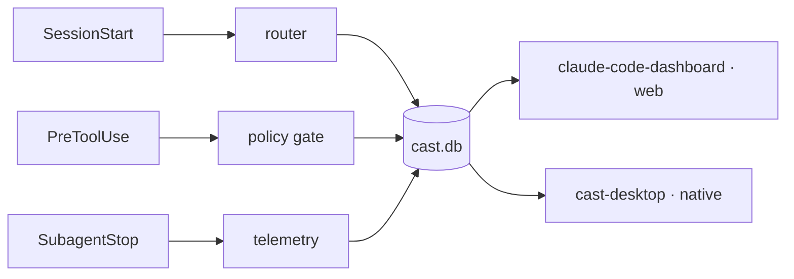

# Edward Kubiak

> **Open-source developer** — I build developer tools (agent infrastructure, guardrails) and open data platforms.

**Columbus, Ohio** · [edwardkubiak.com](https://edwardkubiak.com)

By day I architect and maintain production EdTech at META Solutions for Ohio school districts. Nights and weekends I build open-source infrastructure and data projects.

**Focus: multi-agent systems, developer tools, and open-source infrastructure.**

---

## What I work on

Multi-agent systems fail in predictable ways: routing is opaque, memory bleeds across agents, policy is aspirational, and observability stops at the tool call. I build **[CAST](https://github.com/ek33450505/claude-agent-team)** to close those gaps — a local-first control plane for Claude Code — and a family of standalone, zero-LLM guardrails that fell out of building it. I also build **[Compute Atlas](https://www.compute-atlas.com)**, an open, source-cited census of U.S. grid-scale compute infrastructure. More at [castframework.dev](https://castframework.dev).

<p align="center">
  <picture>
    <source media="(prefers-color-scheme: light)" srcset="assets/ecosystem-card-light.svg" />
    
  </picture>
</p>

One control plane. Two observability surfaces. A family of deterministic, zero-LLM guardrails — all local-first, all recorded to a single SQLite execution log. Nothing leaves your machine, and nothing calls a model to grade itself.

## Projects at a glance

| Project | What it does | Stack |
|---|---|---|
| **[CAST](https://github.com/ek33450505/claude-agent-team)** ⭐ | Local-first multi-agent control plane for Claude Code | Bash · Python · SQLite |
| **[Compute Atlas](https://github.com/ek33450505/compute-atlas)** 🗺️ | Open, source-cited census of U.S. data centers, mining sites, and dedicated power | Next.js 16 · Postgres · MapLibre |
| **[claude-code-dashboard](https://github.com/ek33450505/claude-code-dashboard)** ✨ | Web observability UI — 21+ views, live SSE streaming | React 19 · Express 5 |
| **[cast-desktop](https://github.com/ek33450505/cast-desktop)** | Native macOS observability app + embedded terminal | Tauri 2 · Rust |
| **[attest](https://github.com/ek33450505/attest)** | Zero-LLM gate: verifies a subagent's `DONE` vs the git delta | Python |
| **[looptrip](https://github.com/ek33450505/looptrip)** | Zero-LLM detector for multi-agent loop pathologies | Python · PyPI |
| **[misfire](https://github.com/ek33450505/misfire)** | Turns the rules your agents ignore into enforcement hooks | Python · PyPI |

<sub>Deep-dives below — click any project to expand.</sub>

---

## CAST
[`claude-agent-team`](https://github.com/ek33450505/claude-agent-team)

[](https://github.com/ek33450505/claude-agent-team/releases)
[](LICENSE)
[](https://github.com/ek33450505/claude-agent-team/tree/main/tests)
[](https://github.com/ek33450505/claude-agent-team/tree/main/agents/core)

A local-first control plane for Claude Code. Multi-agent systems need observability, persistence, and unforgeable policy — CAST ships all three by construction, hung off Claude Code's own lifecycle hooks and recorded in a SQLite database that two surfaces read from.



- **Hook-driven dispatch over polling.** Routing, telemetry, and policy hang off lifecycle events (`SessionStart`, `PreToolUse`, `SubagentStop`, `Stop`) — no daemon, no background loop, no missed events.
- **Local-first SQLite everywhere.** Agent runs, routing decisions, memory, and quality gates all live in `~/.claude/cast.db`, replicated off the blast radius via Litestream — the database survives a full `~/.claude` wipe.
- **Per-agent memory, not shared context.** Each agent keeps scoped memory; isolation by default, coordination only when asked for.
- **Hard-blocking policy gates.** Force-pushes, raw `git commit`, destructive shell ops — refused at the hook seam, not left to agent discipline.
- **Every override is on the record.** Each escape hatch writes an `ack_events` row with the reason, so an absent row means the hatch was never used — not that the recorder failed.

<sub><!-- CAST_AGENT_COUNT -->27<!-- /CAST_AGENT_COUNT --> specialist agents · <!-- CAST_TEST_COUNT -->3323<!-- /CAST_TEST_COUNT --> BATS tests · <!-- CAST_DB_TABLE_COUNT -->42<!-- /CAST_DB_TABLE_COUNT --> tables in <code>cast.db</code> · <!-- CAST_COMMAND_COUNT -->21<!-- /CAST_COMMAND_COUNT --> commands · <!-- CAST_SKILL_COUNT -->18<!-- /CAST_SKILL_COUNT --> skills · <!-- CAST_PACKAGE_COUNT -->9<!-- /CAST_PACKAGE_COUNT --> Homebrew packages. Counts auto-refresh from the flagship's canonical stats — never hand-edited.</sub>

<details>
<summary><b>v10.0.0 — "Make the Gates Tell the Truth"</b>: what a release looks like when you audit your own guardrails</summary>

<br>

49 merged PRs, 423 files, +48,879/−3,259 — with one theme, arrived at the hard way:

> **A gate that has never failed is indistinguishable from a gate that cannot fail.**

Nearly every item in the release came from asking of an existing check: *what does its output look like when the thing it guards did not happen?* — and finding the answer was "identical to success."

- The **destructive-op guard** was registered in the hook-contract gate but never actually executed by it.
- The **session-end prune** had been failing on every run for months, swallowed behind a `|| true`.
- A **`cast doctor` honesty check** compared two timestamp formats that can never match, so it could never fire.
- The **review gate** could be satisfied by a review of a different artifact entirely — six defects, one Critical. Subagent self-review is now structurally impossible.
- The **git guard** scanned only the first line of a Bash command; quoting and global options each defeated the whole module. Thirteen previously unguarded destructive git ops are now covered, each measured before a pattern was written.
- **63%** of every recorded protocol violation turned out to be a well-formed handoff, and `cast verify-chain` reported tamper for **244 of 929** links — none of which was tamper.

Tests went 2,353 → 3,320 across 204 → 239 files, and the new ones are **mutation-tested**: reverted against the bug they guard and confirmed RED first, because an assertion that never fails is the same defect one level up. Two of this release's own tests were caught that way and would otherwise have shipped green and empty.

📄 [Full changelog](https://github.com/ek33450505/claude-agent-team/blob/main/CHANGELOG.md)

</details>

```bash
# Claude Code plugin (recommended)
/plugin marketplace add ek33450505/claude-agent-team
/plugin install cast && /plugin enable cast@cast
# or: brew tap ek33450505/cast && brew install cast
```

---

## Observability — two surfaces, one data layer

Everything CAST records lands in `cast.db`. Read it on the web, or natively — same data, two delivery models.

<details>
<summary><b>claude-code-dashboard</b> ✨ — web observability UI for CAST (21+ views, live SSE)</summary>

<br>

[`claude-code-dashboard`](https://github.com/ek33450505/claude-code-dashboard) · React 19 · TypeScript · Vite 6 · Express 5 · better-sqlite3 · Tailwind v4

A browser dashboard for everything CAST records. Reads `~/.claude/` directly and streams live session data over SSE — which agents fired, what they cost, whether the guards are holding. 21+ lazy-loaded views spanning sessions, analytics, agent reliability, hook health, incidents, quality gates, a memory browser, plans, the dispatch log, token spend, and a database explorer. No accounts, no telemetry, nothing leaves your machine.

```bash
git clone https://github.com/ek33450505/claude-code-dashboard
cd claude-code-dashboard && npm install && npm run dev
```

</details>

<details>
<summary><b>cast-desktop</b> — native macOS observability app with an embedded terminal</summary>

<br>

[`cast-desktop`](https://github.com/ek33450505/cast-desktop) · Tauri 2 · Rust · TypeScript

The same `cast.db`, packaged as a self-contained native app — no Node, no server to run. An embedded PTY terminal with persistent pane-to-session binding, an inline CodeMirror editor that dispatches agents on selection, 11 dashboard views over 40+ read-only loopback routes, and live per-session cost streaming ($/min plus a 4-hour projection). Keyboard-first, with a command palette and a native macOS menu bar.

```bash
brew tap ek33450505/cast && brew install --cask cast-desktop
```

</details>

---

## Guardrails & detectors

Three standalone, deterministic, **zero-LLM** tools for Claude Code. None calls a model — so none adds tokens or can hallucinate its own verdict. They grade the *act* against ground truth on disk.

<details>
<summary><b>attest</b> — catches a subagent's false <code>DONE</code> against the real git delta</summary>

<br>

[`attest`](https://github.com/ek33450505/attest) · Python 3 (stdlib-only) · MIT

> **"DONE" is a claim, not proof. Grade the act, not the output.**

A subagent reports `Status: DONE` after a `Write` that returned success but never landed on disk — a silent write-failure behind a confident claim. attest snapshots the git tree on `SubagentStart`, recomputes the delta on `SubagentStop`, and checks whether the files it *claimed* to change actually changed. If a claimed file never landed, it (opt-in) blocks the completion so the same agent is forced to fix it. Fail-open on every doubt; verified end-to-end against real Claude Code with captured payloads committed to the repo.

```bash
/plugin marketplace add https://github.com/ek33450505/attest
# or: brew tap ek33450505/attest && brew install attest
```

</details>

<details>
<summary><b>looptrip</b> — trips multi-agent loops at iteration 2, not on the invoice</summary>

<br>

[`looptrip`](https://github.com/ek33450505/looptrip) · Python 3 · Apache-2.0 · [](https://pypi.org/project/looptrip/)

> **Catch the loop at iteration 2 — not on the invoice.**

The failure mode that quietly burns money: agents *loop* — the same subagent dispatched again and again with no progress between repeats (duplicate-work, ping-pong / livelock, deadlock, non-termination), and you find out on the bill. looptrip watches a run as a stream of normalized events and trips at the **second** dispatch. An observer, never a gate. Works over OpenTelemetry GenAI spans or a CAST `cast.db` — no new instrumentation. On two real recorded runaway sessions, tripping at iteration 2 would have averted **$792.96** of duplicate-work spend (`looptrip proof` reproduces it).

```bash
pip install looptrip
# or: brew tap ek33450505/looptrip && brew install looptrip
```

</details>

<details>
<summary><b>misfire</b> — measures which of your prose rules agents actually ignore, then enforces only those</summary>

<br>

[`misfire`](https://github.com/ek33450505/misfire) · Python 3 (stdlib-only) · Apache-2.0 · [](https://pypi.org/project/misfire/)

> **Prose rules are hopes. misfire ranks the ones your agents ignore — and converts only those to hooks.**

Most agent guardrails are written up front and hoped to hold. misfire works backward from evidence: it reads your `CLAUDE.md`, `.claude/rules/*.md`, and your own run history, then ranks which machine-checkable prose rules your agents *demonstrably* ignore — by observed violation rate, with confidence thresholds and a minimum-support floor. For the violated, convertible subset only, it scaffolds a deterministic PreToolUse/PostToolUse hook for you to review — leaving safety and judgment rules as prose. An observer and recommender, never a gate: it never auto-applies a change and never writes `settings.json`. The ranking is byte-reproducible against a committed fixture with no database (`misfire rank` reproduces it).

```bash
pip install misfire
# or: brew tap ek33450505/misfire && brew install misfire
```

</details>

---

## The CAST ecosystem

Beyond the flagship, CAST has spun off a constellation of small, single-purpose tools — a read-only MCP server over the execution record, signed hash-chained session receipts, telemetry-driven dispatch prediction, persistent agent memory, a standalone install health check, a clock, and a cross-session journaling layer. Each ships independently; each installs via Homebrew.

<details>
<summary><!-- CAST_PACKAGE_COUNT -->9<!-- /CAST_PACKAGE_COUNT --> Homebrew-installable packages — the full table</summary>

<!-- Locked ecosystem block, synced by hand from claude-agent-team/docs/ecosystem.md — do not edit out of step with the flagship. -->

<!-- ECOSYSTEM_START -->
**Core Framework**

| Repo | Description | Latest | Install |
|---|---|---|---|
| [claude-agent-team](https://github.com/ek33450505/claude-agent-team) | Local-first multi-agent control plane — specialist agents, quality gates, hook enforcement, and the tamper-evident cast.db execution record. |  | `brew tap ek33450505/cast && brew install cast` |

**Observability**

| Repo | Description | Latest | Install |
|---|---|---|---|
| [claude-code-dashboard](https://github.com/ek33450505/claude-code-dashboard) | React observability UI — sessions, agent analytics, hook health, memory browser, SQLite explorer. |  | Clone from GitHub |
| [cast-desktop](https://github.com/ek33450505/cast-desktop) | Tauri 2 native app — embedded PTY terminal, command palette, 11 dashboard views. |  | `brew tap ek33450505/cast && brew install --cask cast-desktop` |

**Standalone Packages**

| Repo | Description | Latest | Install |
|---|---|---|---|
| [cast-mcp](https://github.com/ek33450505/cast-mcp) | Read-only MCP server over the Claude Code execution record (cast.db) — dispatch decisions, incidents, cost, sessions, and full-text search as 5 MCP tools + 5 resources. stdlib-only, strictly read-only. |  | `brew tap ek33450505/cast-mcp && brew install cast-mcp` |
| [cast-ledger](https://github.com/ek33450505/cast-ledger) | Signed, hash-chained, tamper-evident session receipts for Claude Code — SHA-256-stamped audit receipts from cast.db with `--verify`, plus an optional provenance hash-chain across sessions. |  | `brew tap ek33450505/cast-ledger && brew install cast-ledger` |
| [cast-predict](https://github.com/ek33450505/cast-predict) | Telemetry-driven dispatch prediction for Claude Code — reads cast.db to predict a task's likely cost, suggest agents, and surface related past incidents before you run it. |  | `brew tap ek33450505/cast-predict && brew install cast-predict` |
| [cast-memory](https://github.com/ek33450505/cast-memory) | Persistent agent memory for Claude Code — FTS5 full-text search, weighted relevance, temporal validity, Ollama embeddings, and weekly consolidation over cast.db. |  | `brew tap ek33450505/cast-memory && brew install cast-memory` |
| [cast-doctor](https://github.com/ek33450505/cast-doctor) | Standalone read-only health check for any Claude Code install — validates hooks, MCP config, agent frontmatter, cast.db core schema, and stale memories without the full CAST framework. |  | `brew tap ek33450505/cast-doctor && brew install cast-doctor` |
| [cast-time](https://github.com/ek33450505/cast-time) | Gives Claude Code a clock — injects local time, timezone, and a semantic time-of-day bucket at every SessionStart. |  | `brew tap ek33450505/cast-time && brew install cast-time` |
| [cast-claudes_journal](https://github.com/ek33450505/cast-claudes_journal) | Three-hook journaling for Claude Code (Stop/SessionStart/UserPromptSubmit) — maintains Claude's perspective and working memory across sessions as Obsidian-compatible markdown in ~/Documents/Claude/. |  | `brew tap ek33450505/homebrew-claudes-journal && brew install claudes-journal` |
<!-- ECOSYSTEM_END -->

</details>

---

## Compute Atlas

[`compute-atlas`](https://github.com/ek33450505/compute-atlas) · live at **[compute-atlas.com](https://www.compute-atlas.com)**

[](https://www.compute-atlas.com/stats)
[](https://www.compute-atlas.com/states)
[](https://github.com/ek33450505/compute-atlas/releases)
[](https://github.com/ek33450505/compute-atlas/blob/main/LICENSE)
[](https://github.com/ek33450505/compute-atlas/blob/main/LICENSE-DATA)

> **There is no national registry of data centers. This is an attempt at one — with a public source behind every record.**

Compute Atlas is an open, provenance-first census of U.S. grid-scale compute infrastructure: hyperscale and AI/ML campuses, crypto-mining operations, and the **dedicated power generation** built or contracted to supply them — tracked from proposed and permitted through under construction and operational. Coverage spans all 50 states, and every record links at least one public source (permit filings, SEC filings, utility interconnection queues, company announcements, subsidy disclosures) with a label, a source kind, and a retrieval date. Intended audience: journalists, researchers, local officials, and residents.

**The discipline is the product.**

- **A source for every record**, or the record does not exist.
- **Honest confidence** — every facility is marked `confirmed` / `reported` / `rumored`, and compute records carry a separate AI classification (`confirmed` / `likely` / `mixed_use`). Uncertainty is surfaced, not hidden.
- **Numbers only when firm** — ranges, ceilings, and modeled projections go in a record's notes, never into a numeric field. Statutory *eligibility* for an incentive is never recorded as a confirmed award.
- **Human approval is the core invariant.** A scheduled discovery pipeline proposes candidates and mechanically verifies each cited URL against the claim it supports (using a local model on the maintainer's machine, never in the deployed app) — but nothing becomes a live facility without a human review step.

**What you can do with it**

| Surface | |
|---|---|
| 🗺️ **Interactive map** | MapLibre, with water and geology overlays, siting-context datums, and a radius tool |
| 📊 **Sortable table & dossiers** | Per-facility pages with full source lists and status history |
| ⚡ **Power** | Dedicated generation tracked as a first-class facility type, with capacity roll-ups |
| 🏛️ **Civic footprint** | Energy, water, subsidies, jobs, and community impact — public but scattered across county records and water-authority filings |
| 🚫 **Opposition** | Defeated projects and local-opposition cancellations, tracked as a dimension |
| 👥 **Stakeholders** | Named people with a documented stake in specific facilities |
| 📚 **Learn** | Cited prose explainers, not just statistics |
| 🔌 **Public API** | CORS-open, no auth, CDN-cached, `X-License: CC-BY-4.0` — `/api/facilities`, `/api/search`, `/api/stats`, `/api/schema` |
| 📦 **Bulk data** | The entire dataset published as a CC BY 4.0 JSON snapshot anyone can download, fork, and cite |

**Under the hood.** Next.js 16 (App Router, RSC, ISR) · React 19 · TypeScript + Zod (runtime-validated records with JSON Schema export) · Neon Postgres + Drizzle ORM as the authoritative store · MapLibre GL · Tailwind v4 + shadcn/ui · Vitest + Playwright in CI. `data/facilities.json` is a generated export, never hand-edited — every data wave runs DB-first through a dry-run-by-default sync that writes facility history and busts cache tags.

Dual-licensed: **MIT** for the code, **CC BY 4.0** for the data.

---

## Stack

Bash · Python · TypeScript · React 19 · Next.js 16 · Express 5 · SQLite · Postgres · BATS · Vitest · Playwright · Tauri 2 · GitHub Actions · Homebrew. macOS first, Linux supported. Anthropic API + Claude Code Agent SDK.

---

Building in public · [edwardkubiak.com](https://edwardkubiak.com)
